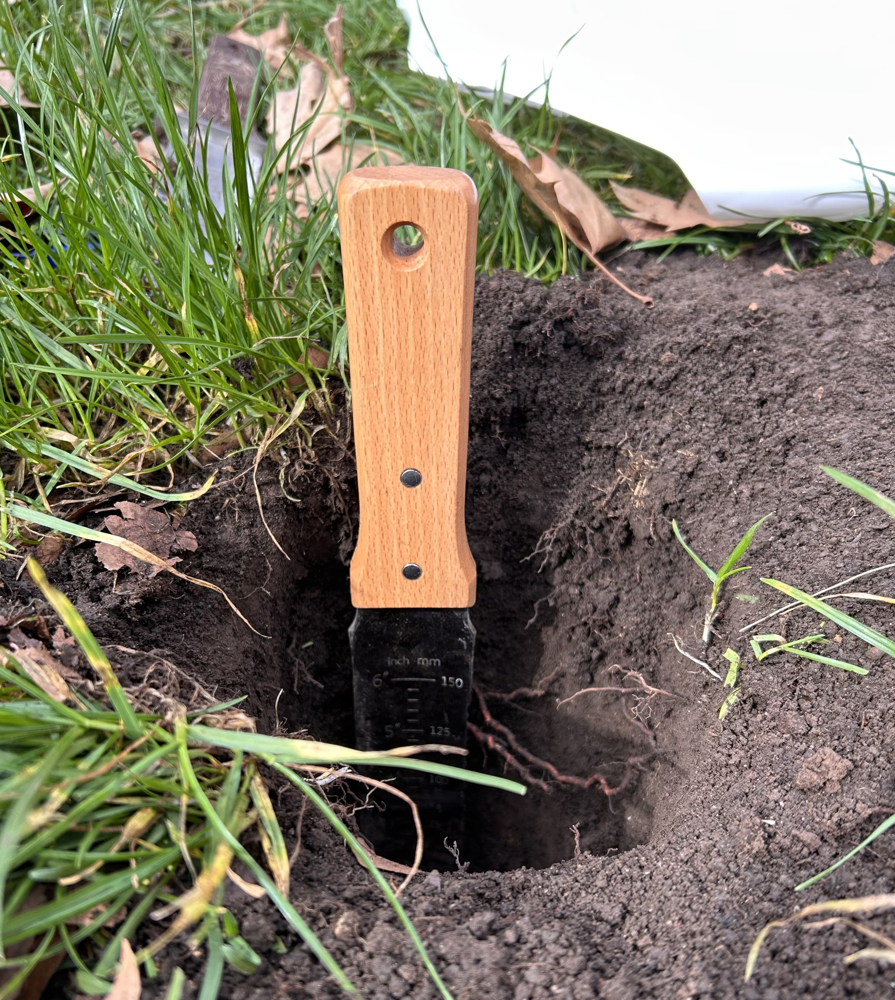
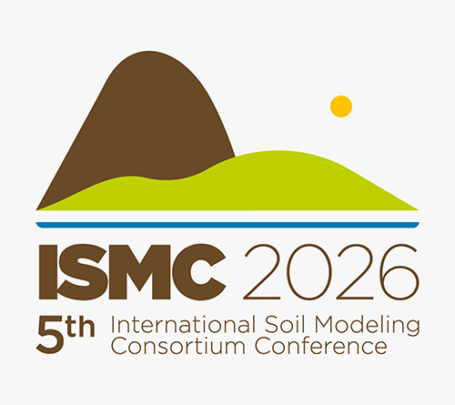

```{r setup, include=FALSE}
knitr::opts_chunk$set(echo = FALSE, warning = FALSE, message = FALSE)
```

## Urban expansion and the carbon cycle

- Urban expansion has transformed natural soils and disrupted biogeochemical flows (O'Riordan et al., 2021);
- Soil sealing (pavement, gray infrastructure) is one of the most discussed forms of urban soil degradation (Lehmann, 2006);
- Sealing interrupts natural carbon (C) inputs - expected gradual decrease and stabilization of soil C stocks.

## Contrasting effects of sealing

\- Soil sealing can also:

- Reduces organic matter (OM) decomposition rate (Lu et al., 2020);
- Lowers microbial biomass;
- Decreases soil respiration (Pereira et al., 2021);
- Hypothesis in the literature: C may actually accumulate beneath sealed surfaces.

## How's the C dynamic in sealed soils?

- Urban sealed soils show ambiguous C distribution (O'Riordan et al., 2021);
- Partial evidence suggests urban C reservoirs may exist, but but they remain unquantified;
- In South America specifically, there is a lack of data on how soil sealing affects soil quality attributes, including C concentration (Liu et al., 2026);
- This limits accurate urban C budget modeling and climate change mitigation planning.

## Central hypothesis

> The vertical patterns of C differ between sealed and unsealed soils.

<br>

- Understanding this is key to determining whether sealed urban soils are an underestimated C reservoir.

## Objectives

- Quantify the vertical gradients of total C in 3 sealed and 2 surrounding unsealed soils located in urban greenspaces of Santiago, Chile;

- Three depths: 0-10, 10-20, and 20-30 cm;

- To determine whether sealing drives C accumulation or depletion along the soil profile.

## Methods {.spaced-list}

<div class="methods-layout">
<div class="methods-col">
<div class="methods-sampling-text">
- Rio-pav (paved soils) - Bellas Artes, Santiago, Chile - 3 sampling sites;

- Rio-ug (urban green space soils) - Cerro Santa Lucía and Parque Forestal, Santiago, Chile - 2 sampling sites.
</div>

```{r sampling-map, echo=FALSE}
library(leaflet)
leaflet(width = "100%", height = "220px") %>%
  addTiles() %>%
  addMarkers(lng = -70.643330, lat = -33.437043, popup = "Rio-PAV 1") %>%
  addMarkers(lng = -70.644514, lat = -33.435859, popup = "Rio-PAV 2") %>%
  addMarkers(lng = -70.647190, lat = -33.437729, popup = "Rio-PAV 3") %>%
  setView(lng = -70.645, lat = -33.4365, zoom = 14)
```
</div>

<div class="methods-col">
<div class="methods-text">
- Soil samples: air-dried, sieved (< 2 mm), analyzed in triplicate;
- Texture: determined after OM removal (H2O2, 30%), using a PARIO suspension pressure sensor;
- pH: measured at 1:2.5 ratio;
- Total C: high-temperature catalytic combustion (TOC-L analyzer, Shimadzu, Japan).
</div>

</div>
</div>

## Results

<div style="text-align:left;">
\- Salvando para inserir la distribución vertical de C aquí;

- Sealed vs. unsealed C profiles by depth;
- Texture and pH by site;
- Statistical comparison (sealed vs. unsealed, by depth).
</div>

## Implications for urban C budgets {.spaced-list}

- Sealed urban soils may represent an underestimated component of urban C storage;
- Should not be excluded from urban ecosystem C modeling;
- Contributes evidence toward closing the South American data gap on urban soil sealing effects.

## References {.spaced-list}

<div style="font-size:0.55em; text-align:left;">
Lehmann, A. (2006). Technosols and other proposals on urban soils for the WRB (World Reference Base for Soil Resources). *Int. Agrophys., 20*(2), 129–134

Liu, H., Tan, X., Xiao, R., Tian, P., He, X., Wang, J., & Li, Y. (2026). Global patterns of urban soil degradation: Revealing the impacts of urbanization on natural and sealed urban soils. *Ecological Indicators*, *185*, 114755. https://doi.org/10.1016/j.ecolind.2026.114755

Lu, C., Kotze, D. J., & Setälä, H. M. (2020). Soil sealing causes substantial losses in C and N storage in urban soils under cool climate. *Science of the Total Environment*, *725*, 138369. https://doi.org/10.1016/j.scitotenv.2020.138369

O'Riordan, R., Davies, J., Stevens, C., and Quinton, J. N. (2020). The effects of sealing on urban soil carbon and nutrients, *SOIL*, *7*, 661–675, https://doi.org/10.5194/soil-7-661-2021

Pereira, M.C., O’Riordan, R. & Stevens, C. 2021. Urban soil microbial community and microbial-related carbon storage are severely limited by sealing. *J Soils Sediments 21*, 1455–1465. https://doi.org/10.1007/s11368-021-02881-7


</div>

## Questions?

- Thank you for your attention! I am happy to take any questions.

## Thank you! {data-background-color="#EECFA1"}

**Mariana Dos Santos Moreno**

Email: mdsmoreno@estudiante.uc.cl

Facultad de Agronomía y Sistemas Naturales, PUC Chile

CEDEUS - Centro de Desarrollo Urbano Sustentable

<script>
document.addEventListener('DOMContentLoaded', function () {
  var titleSlide = document.querySelector('#title-slide') ||
                    document.querySelector('.reveal .slides > section:first-child');
  if (titleSlide) {
    var affiliations = document.createElement('div');
    affiliations.className = 'title-affiliations';
    affiliations.innerHTML =
      '<sup>a</sup> Facultad de Agronomía y Sistemas Naturales, Pontificia Universidad Católica de Chile, 7820436 Santiago, Chile<br>' +
      '<sup>b</sup> Centro de Desarrollo Urbano Sustentable ANID CEDEUS CIN250009, El Comendador 1916, Providencia, Santiago, Chile<br>' +
      '<sup>c</sup> Department of Plant Sciences, University of California, Davis. PES-1238, One Shields Avenue, Davis, CA 95616, USA<br>' +
      '<sup>d</sup> Department of Geography, Humboldt Universität zu Berlin, Berlin, 10117, Germany<br>' +
      '<sup>e</sup> Departamento de Ingeniería Hidráulica y Ambiental, Pontificia Universidad Católica de Chile, Av. Vicuña Mackenna 4860, Macul, Santiago 7820436, Chile';
    titleSlide.appendChild(affiliations);

    // Move the date (rendered by pandoc right after the author) to
    // appear after the affiliations block instead of before it.
    var dateEl = titleSlide.querySelector('h3.date') || titleSlide.querySelector('.date');
    if (dateEl) {
      titleSlide.appendChild(dateEl);
    }

    var logos = document.createElement('div');
    logos.className = 'title-logos';
    logos.innerHTML =
      '' +
      '' +
      '';
    titleSlide.appendChild(logos);
  }
});
</script>